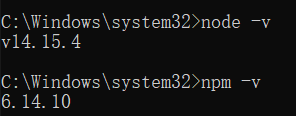
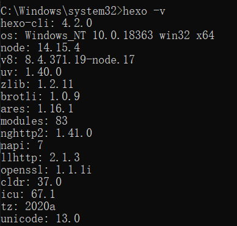
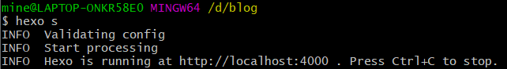
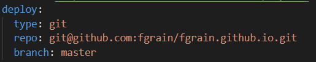
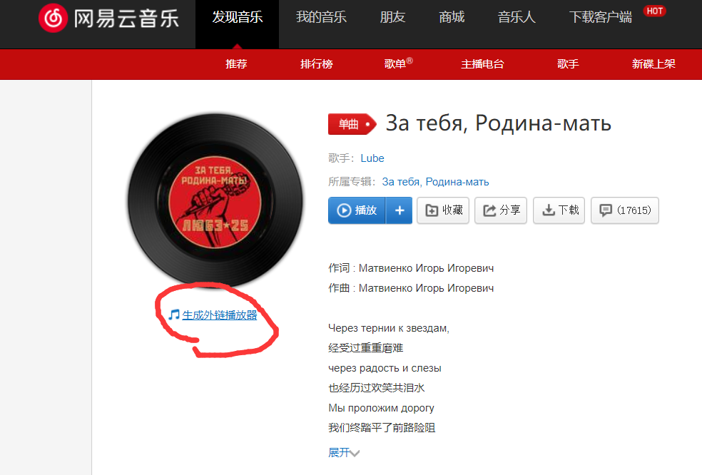
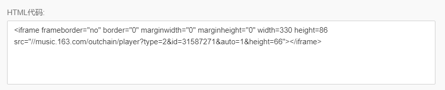
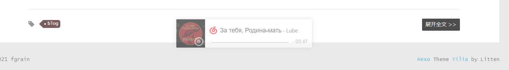

### 准备工作

* 安装node.js   ( https://nodejs.org ）

  安装成功后查看版本：



* 安装淘宝镜像源

``` bash
npm install -g cnpm --registry=https://registry.npm.taobao.org
```

  * 安装hexo框架

``` bash
cnpm install -g hexo-cli
```

* 本次安装在D:\blog，windows下管理员权限打开cmd，在指定目录下执行hexo init，需要先安装git然后配置环境变量，安装成功后-v查看

<!-- more -->



### 配置博客

* 启动博客

```bash
hexo s
```



* 在blog目录下下载git插件

```bash
cnpm install --save hexo-deployer-git
```

* 在github上创建一个仓库，仓库名为GitHub的登录名.github.io
* 配置_config.yml文件



* 新建md格式文件：hexo n “文件名”
* 清楚缓存：hexo clean
* 生成：hexo g
* 部署到远端：hexo d


### 插入图片

* 安装插件，在hexo根目录打开gitbash执行

```bash
    npm install hexo-asset-image --save
```

* 打开hexo的配置文件_config.yml，找到 post_asset_folder，把这个选项从false改成true
* 插入图片了，比如hexo n photo之后就在source/_posts生成photo.md文件和photo文件夹，我们把要插入的图片复制到photo文件夹内


### 播放音乐

举例：网易云音乐



打开后复制如下代码：



将代码粘到主题的layout/_partial加下的footer.ejs文件中，就会在页脚生成音乐播放器。



ps：由于hexo是静态框架，刷新界面会从头播放音乐